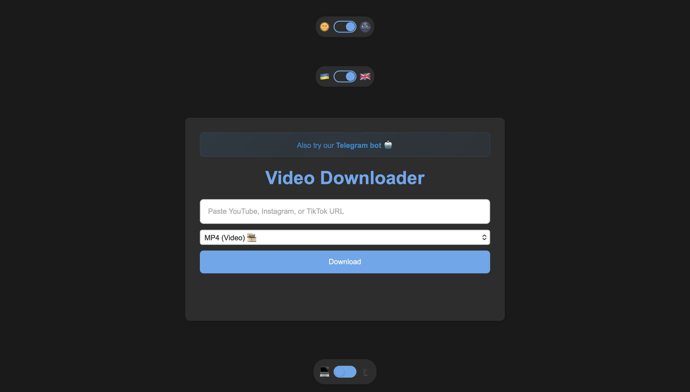
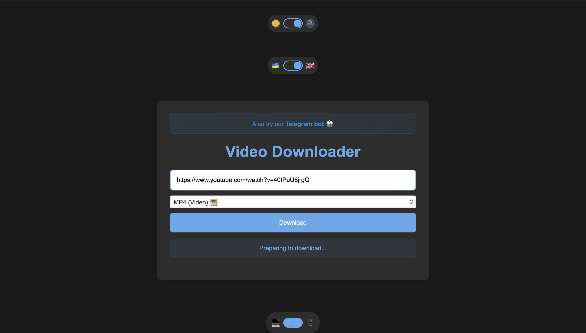
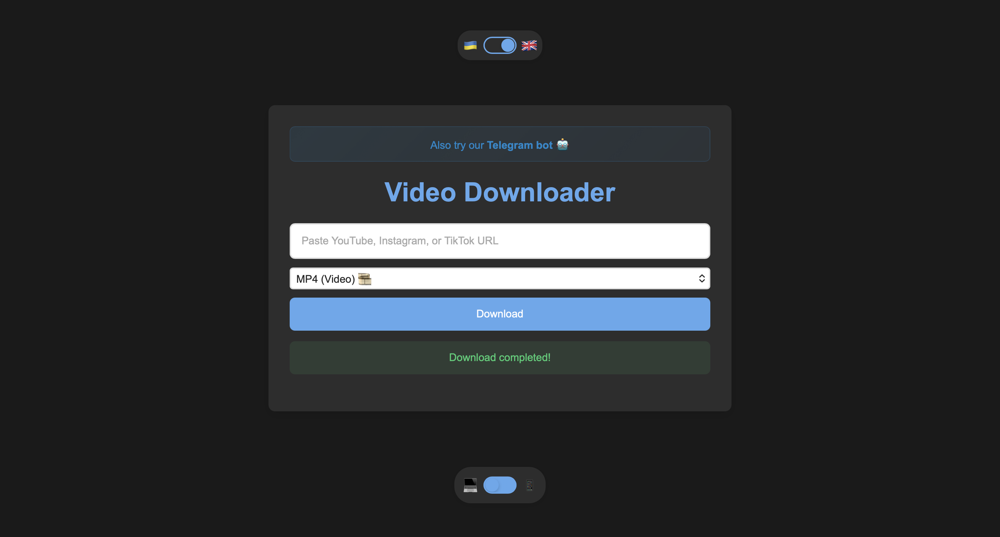
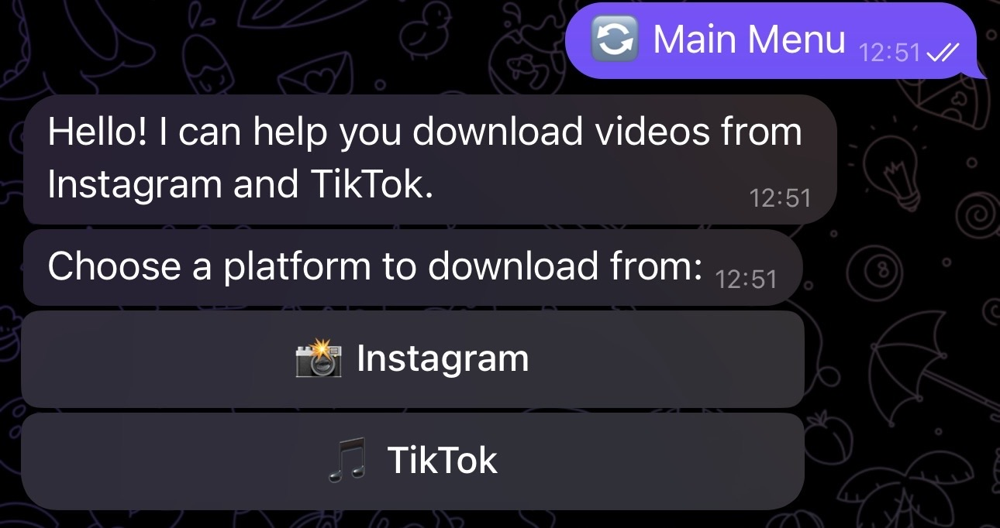
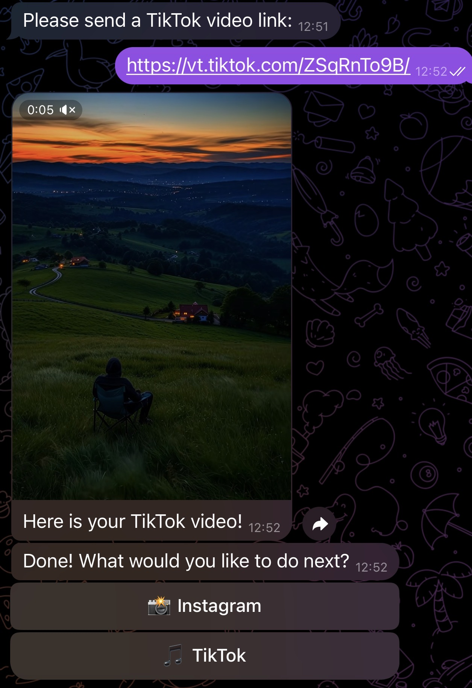

# 🎬 VideoDW: Asynchronous Media Processing Service


VideoDW is a Python-based media downloader for YouTube, Instagram, and TikTok. It provides a web interface and a Telegram bot, with Docker and Nginx configuration for VPS deployment.

🌐 **Try VideoDW online:** [https://videodw.pp.ua](https://videodw.pp.ua)

The project demonstrates advanced backend capabilities, including real-time progress streaming (Server-Sent Events), dynamic video compression via FFmpeg, and asynchronous task management.

## ✨ Core Features

*   **Multi-Platform Support:** Handles YouTube, Instagram (Reels/Posts), and TikTok URLs.
*   **Format Extraction:** Supports `MP4` video and `MP3` audio through the web interface.
*   **Dual Interfaces:**
   *   🤖 **Telegram Bot Interface:** Asynchronous `python-telegram-bot` bot for Instagram and TikTok downloads.
   *   🌐 **Web Interface:** FastAPI backend with a responsive Vanilla JS/CSS frontend, dark/light modes, Ukrainian/English UI, and streamed progress updates.
*   **Media Processing:** MP4 conversion and audio extraction using FFmpeg.
*   **200 MB Video Limit:** Downloads stop when a video exceeds 200 MB; temporary files are removed after failures or timeouts.
*   **Deployment:** Docker Compose with FastAPI, Telegram bot, and Nginx services.

## 🛠️ Technical Stack

*   **Language:** Python 3.9+
*   **Web Backend:** FastAPI, Uvicorn, Pydantic, Python `asyncio`
*   **Telegram Bot:** python-telegram-bot
*   **Media:** yt-dlp, FFmpeg, ffmpeg-python
*   **Frontend:** HTML5, CSS3, Vanilla JavaScript
*   **Proxy and Deployment:** Nginx, Docker, Docker Compose
*   **API:** REST endpoints with streamed JSON progress updates

## 🖼️ Screenshots

### Web Interface

<p align="center">
   
</p>

<p align="center">
   
   
</p>

### Telegram Bot

<p align="center">
   
   
</p>

## 🏗️ Project Structure

```text
videodw/
├── TelegramBot/
│   └── bot_main.py        # Telegram bot entry point
├── WebSite/
│   ├── backend/
│   │   └── main.py        # FastAPI backend
│   └── frontend/
│       ├── index.html      # Web interface
│       ├── script.js       # Client-side logic
│       └── styles.css      # Frontend styles
├── Dockerfile             # Python image with FFmpeg
├── docker-compose.yml     # Backend, bot, and Nginx services
├── nginx.conf             # Static files and /api reverse proxy
├── .env.example           # Environment variable template
├── requirements.txt       # Python dependencies
└── README.md
```

## 🚀 Getting Started

### Prerequisites
*   Python 3.9 or higher
*   **FFmpeg** installed and added to your system's PATH.
*   Docker and Docker Compose for VPS deployment.

### Installation

1. **Clone the repository:**
   ```bash
   git clone [https://github.com/Denius88/videodw.git](https://github.com/Denius88/videodw.git)
   cd videodw
   ```

2. **Install dependencies globally or in a virtual environment:**
   ```bash
   python3 -m pip install -r requirements.txt
   ```

3. **Environment Setup:**
   Create an environment variable for the Telegram Bot token:
   ```bash
   export TELEGRAM_BOT_TOKEN="your_bot_token_here"
   ```

### Running the Services

**To run the Web Service (FastAPI):**
```bash
python3 WebSite/backend/main.py
```

**To serve the frontend locally:**
```bash
cd WebSite/frontend
python3 -m http.server 5500
```
The web interface will be available at `http://localhost:5500`.

**To run the Telegram Bot:**
```bash
cd TelegramBot
python3 bot_main.py
```

### VPS Deployment with Docker and Nginx

Install Docker and Docker Compose on the VPS, then run:

```bash
git clone https://github.com/Denius88/videodw.git
cd videodw
cp .env.example .env
nano .env
docker compose up -d --build
```

Set `TELEGRAM_BOT_TOKEN` in `.env` before starting the stack. The web interface will be available at `http://YOUR_VPS_IP`, while Nginx proxies `/api` to the FastAPI backend. Useful commands:

```bash
docker compose ps
docker compose logs -f backend
docker compose logs -f bot
docker compose down
```

Open TCP ports 80 and 443 in the VPS firewall. HTTPS can be added later with a domain and Let's Encrypt.

## 🎯 Architecture Highlights for Developers
*   **Real-time Progress:** The FastAPI backend utilizes generator functions and `StreamingResponse` to push JSON progress chunks to the frontend.
*   **Error Handling:** Implements comprehensive `try/except/finally` blocks ensuring that failed downloads still trigger directory cleanup, preventing memory leaks.
*   **Format Selection Logic:** Employs advanced `yt-dlp` format sorting (preferring `h264`, `mp4`, and `aac`) to ensure maximum compatibility across iOS, Android, and desktop devices.

## ⚠️ Disclaimer
This project is built for educational and portfolio demonstration purposes. Users are responsible for adhering to the terms of service of the respective media platforms and respecting copyright laws.
